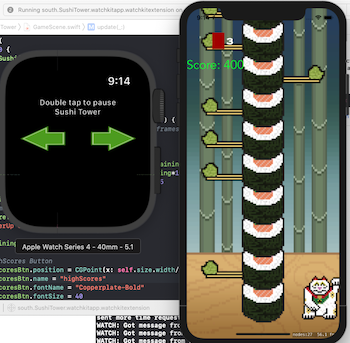
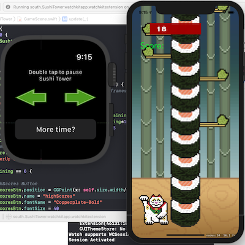
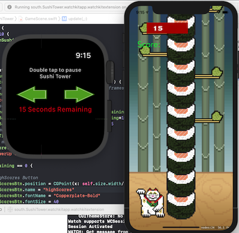
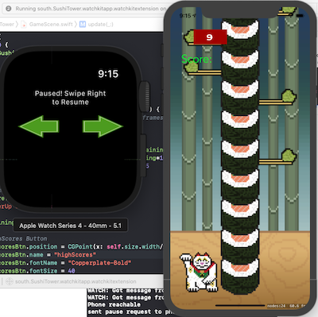
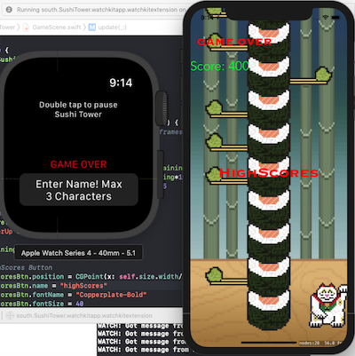
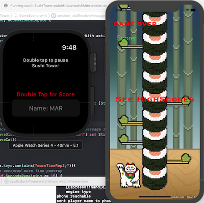
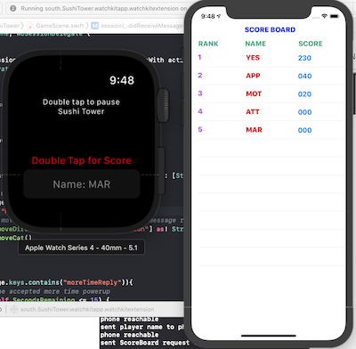

# Name - Ajaydeep Singh
# Student ID - C0744219

#SCREENSHOTS

# Sushi Tower - a clone of Timberman

Timberman demo:

This project is derived heavily from the `Learn to Clone Timberman with SpriteKit and Swift 3` tutorial found on  [Makeschool.com](https://www.makeschool.com/academy/track/learn-to-clone-timberman-with-spritekit-and-swift-3)

